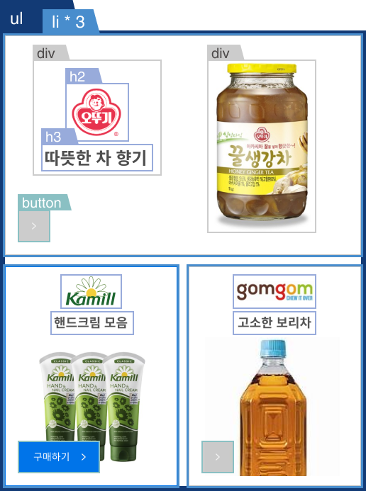

# ✅ mission-01

---

## 1. HTML Markup

---
<figure>
    
</figure>
main

- h1.sr-only
- ul.main-item
    - li.item-01 item-big
        - div.item-start
            - h2.item-logo
                - img
            - h3.item-title
        - div.item-end
            - img
        - button.buy-btn
    - li.item-02 item-small
        - h2.item-logo
            - img
        - h3.item-title
        - img
        - button.buy-btn
    - li.item-03 item-small
        - h2.item-logo
            - img
        - h3.item-title
        - img
        - button.buy-btn
<br /><br /><br />

## 2. 소스코드 설명

---

### # 마크업

- h1에 넣을만한 사이트 로고가 없기 때문에 ‘상품 구매 목록’이라는 텍스트를 쓰고 .sr-only로 화면에 보이지 않게 함
- 순서가 없는 목록이므로 ul, li를 사용

```css
<li class="item-01 item-big">
  <div class="item-start">
    <h2 class="item-logo"></h2>
    <h3 class="item-title">따뜻한 차 향기</h3>
  </div>
  <div class="item-end">
    
  </div>
  <button type="button" class="buy-btn" aria-level="구매하기"></button>
</li>
```

- li에 ‘item-0n’ 클래스를 만들어서 각 목록을 하나씩 구분할 수 있도록 하고, ‘item-big’, ‘item-small’ 클래스로 크기에 따라 공통된 스타일을 적용할 수 있도록 함
- 상품 제목과 이미지가 수직으로 배치되어 있는 .item-small과 달리 수평으로 배치되어 있는 .item-big은 .item-start와 .item-end라는 div로 묶어서 좌우 배치를 함
- button 안에 텍스트를 넣지 않았기 때문에, 스크린리더 사용자를 위해 aria-level=”구매하기”를 넣음

## # css

```css
.main {
  position: absolute;
  top: 50%;
  left: 50%;
  width: 502px;
  box-sizing: border-box;
  transform: translate(-50%, -50%);
}
```

- main이 body를 기준으로 중앙정렬되기 위해 position absolute를 사용
- top, left를 50% 주었을 때, main의 중심점이랑 body의 중심점을 맞추기 위해서
transform으로 main의 x,y축을 -50% 옮김

```css
.main-item {
  display: flex;
  flex-wrap: wrap;
  justify-content: space-between;
  text-align: center;
}
```

- flex wrap을 사용해 줄바꿈이 되도록 했고, space-between으로 각 li가 양쪽 끝에 붙도록 함

```css
.item-big, .item-small {
  position: relative;
  height: 310px;
  border: 1px solid #c4c4c4;
}
```

- 공통된 높이를 지정해주고(너비는 big과 small을 따로 설정), button을 position absolute했을 때 부모인 각각의 li를 기준으로 이동시킬 수 있도록 position을 relative로 변경함

```css
.item-big .item-start, .item-big .item-end {
	display: inline-block;
	position: relative;
}
.item-big .item-start {
  bottom: 90px;
  left: -10px;
}
.item-big .item-end {
  top: 20px;
  left: 35px;
}
```

- li.item big의 자식요소인 div.item-start와 div.item-end는 display를 inline-block으로 설정해 좌우 배치 될 수 있도록 함.

- position을 relative로 바꾸고 각각의 위치를 조절함

```css
.buy-btn {
  position: absolute;
  width: 42px;
  height: 42px;
  left: 18px;
  bottom: 18px;
  border: none;
  background: url("../images/button.svg");
  cursor: pointer;
}

.buy-btn:hover, .buy-btn:focus {
  width: 112px;
  background: url("../images/button-active.svg");
}

.main-item li[class^=item]:hover, .main-item li[class^=item]:focus-within {
  border: 1px solid #0074E9;
}
```

- button의 position을 absolute로 설정해 li.item-big과 li.item-small을 기준으로 위치를 고정함
- 마우스를 올렸을 때와, tab키를 눌렀을 때 버튼을 활성화하기 위해서
hover했을 때와 focus되었을 때 배경 이미지가 변경되도록 함
- button을 focus했을 때 부모요소도 영향을 받게 하고 싶어 focus-within 사용
<br /><br /><br />

## 3. 느낀 점

---

처음에, li 내에 배치한 요소들을 중앙정렬하기 위해서

```css
<li class="item-02 item-small">
	<div class="item-container">
    <h2 class="item-logo"></h2>
    <h3 class="item-title">핸드크림 모음</h3>
    
    <button type="button" class="buy-btn" aria-label="구매하기"></button>
	</div>
</li>
```

위와 같이 div.item-container로 감싸주고 li에 중앙정렬되도록 했었는데, 생각해보니까 굳이 마크업을 추가하지 않아도 padding 조절 등으로 해결할 수 있을 것 같아서 없앴다.

무언가 정렬을 할 때 마크업을 추가하는 버릇이 있었는데, 지금은 ‘이것이 정말 필요한 마크업인가?’ 라고 다시 한 번 생각하면서 구조를 짤 수 있게 되었다.
<br /><br /><br />

## 4. 궁금한 점

---

1. 구매하기 버튼을 svg 이미지로 넣었을 때와, css로 만들었을 때 각각의 장단점 (주로 어떨 때 어떤 방식을 사용하는지)

2. 보통 쇼핑 사이트는 버튼뿐만이 아니라 박스를 클릭했을 때도 페이지가 넘어가는데
그렇게 하고 싶다면 li에 a태그를 함께 사용하나요, js를 사용하나요?
    - a를 사용한다면 a태그 내에 button이 들어가도 되는지, 아니면 button을 제외한 요소를 감싸는지